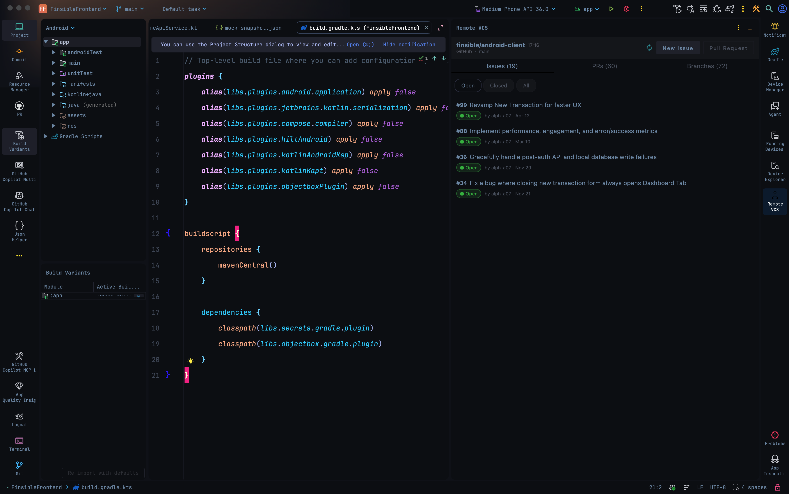
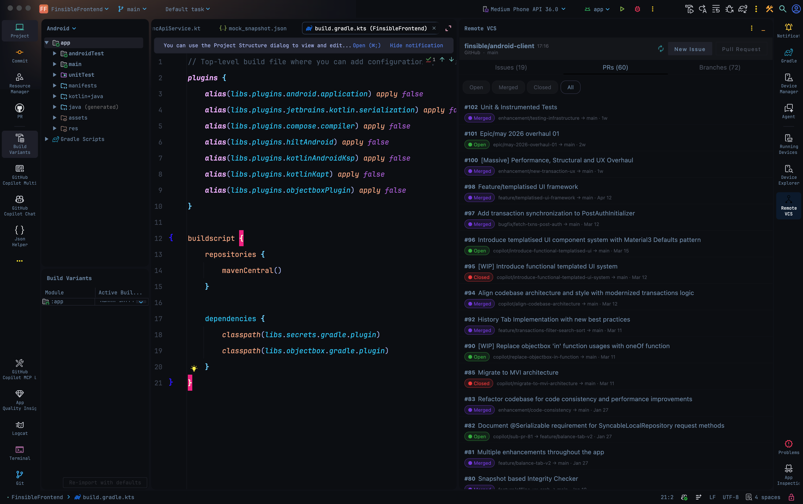
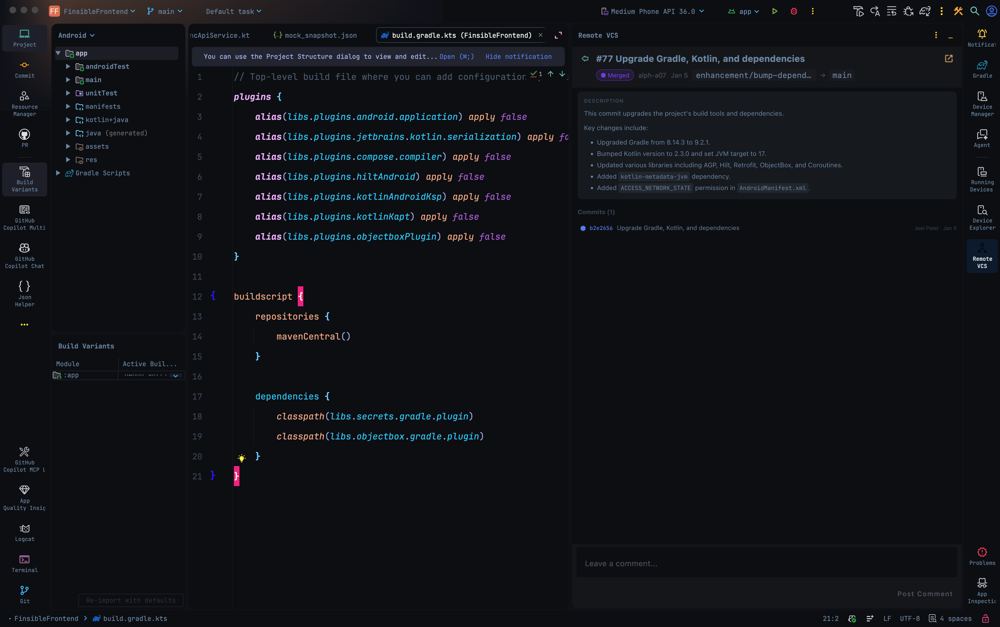
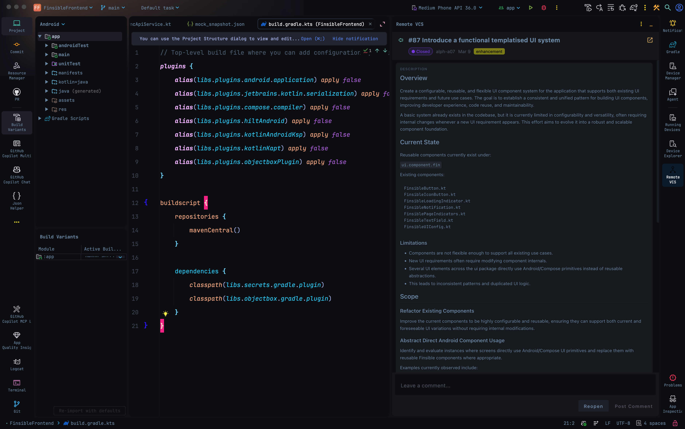

<div align="center">

<!-- Replace with: docs/banner.svg — recommended size 1200×300, dark-mode safe -->


<br/>

**Drop anchor. Manage remote repositories without leaving your editor.**

[](https://github.com/itsjeel01/anchor-vcs/releases)
[](LICENSE)
[](https://kotlinlang.org)

[Install](#installation) · [Screenshots](#screenshots) · [Report a Bug](../../issues/new?template=bug_report.yml) · [Request a Feature](../../issues/new?template=feature_request.yml)

</div>

## Overview

Anchor is a JetBrains plugin that brings your remote Git repository workflow into the IDE as a native tool window. View issues, pull requests, and branches; read descriptions; post comments; and jump to browser when you need to — all without leaving the editor.

## Installation

### JetBrains Marketplace (recommended)

1. Open **Settings → Plugins → Marketplace**
2. Search **"Anchor"**
3. Click **Install**, then restart the IDE
4. The **Anchor** tool window appears in the right sidebar

### From disk

```
Settings → Plugins → ⚙ → Install Plugin from Disk → select anchor-*.zip
```

All builds are available in [GitHub release](../../releases).

### First-time setup

1. Open **Settings → Tools → Anchor - Remote VCS**
2. Generate & validate authentication token in just a few clicks
4. Open the **Anchor** tool window — your repository is auto-detected from the git remote

## Screenshots

<!-- Replace each src with the actual screenshot path under docs/screenshots/ -->

| Issues panel | Pull Requests panel |
|---|---|
|  <br/> filter bar (Open / Closed / All), state badges, metadata |  <br/> Open / Merged / Closed states, source → target branch |

| PR detail | Issue detail |
|---|---|
|  <br/> commit list, clickable SHAs, branch metadata |  <br/>  GitHub Flavored Markdown, embedded images |

> Screenshots from Android Studio on macOS. Appearance is identical across all JetBrains IDEs.

## Supported IDEs

Any IntelliJ-platform IDE at build 253 or later.

| IDE | Status |
|---|---|
| Android Studio | ✅ |
| IntelliJ IDEA (Community & Ultimate) | ✅ |
| WebStorm | ✅ |
| PyCharm | ✅ |
| GoLand | ✅ |
| All other JetBrains IDEs | ✅ |

## Contributing

Bug reports and feature requests go in [GitHub Issues](../../issues). Pull requests are welcome — see [CONTRIBUTING.md](CONTRIBUTING.md) for the full guide.

```bash
git clone https://github.com/itsjeel01/anchor.git
cd anchor
./gradlew runIde          # launch a sandboxed IDE with Anchor loaded
./gradlew buildPlugin     # → build/distributions/anchor-*.zip
./gradlew verifyPlugin    # validate plugin.xml and IDE compatibility
```

## License

MIT © [Jeel Patel](https://github.com/alph-a07)
